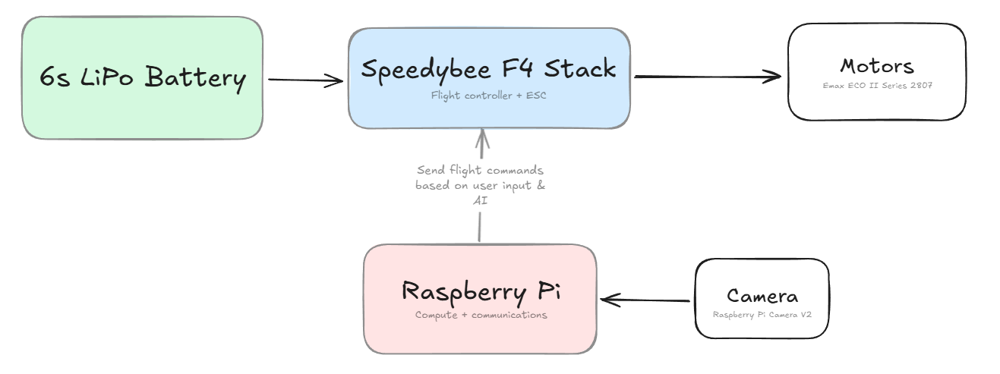
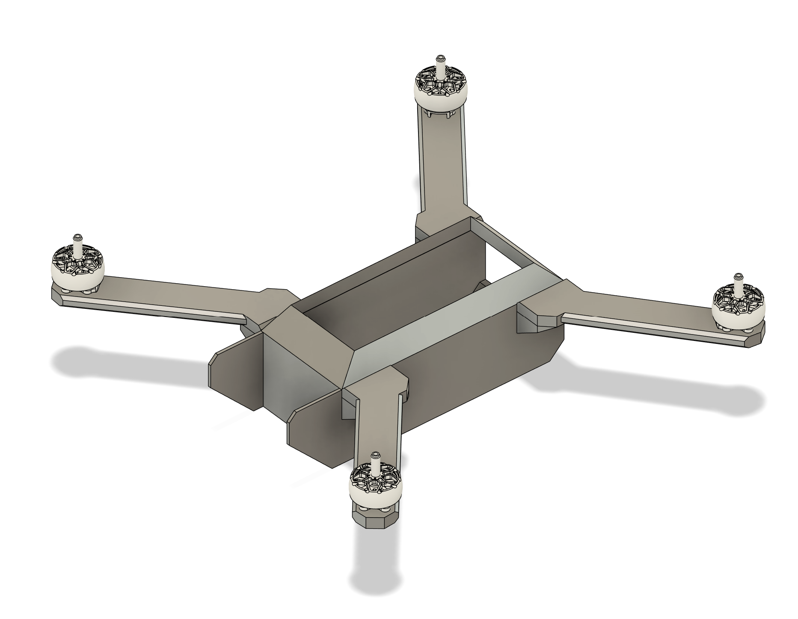
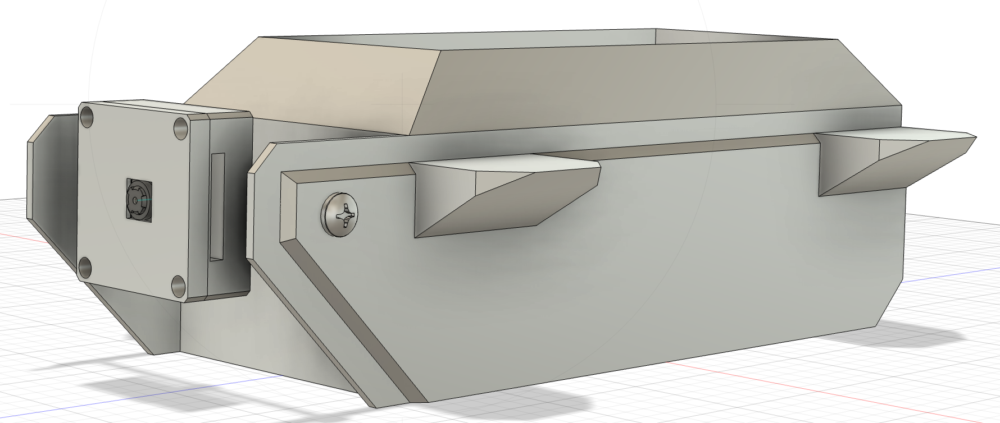
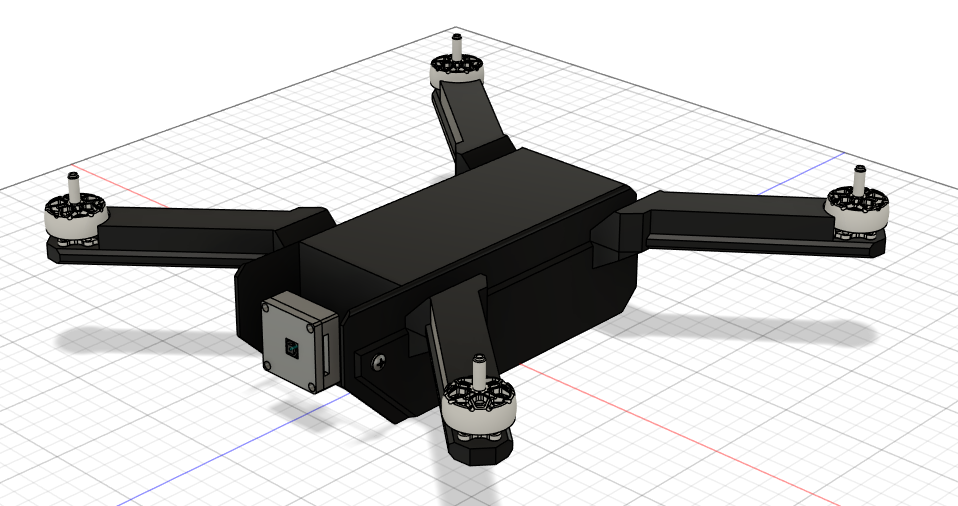
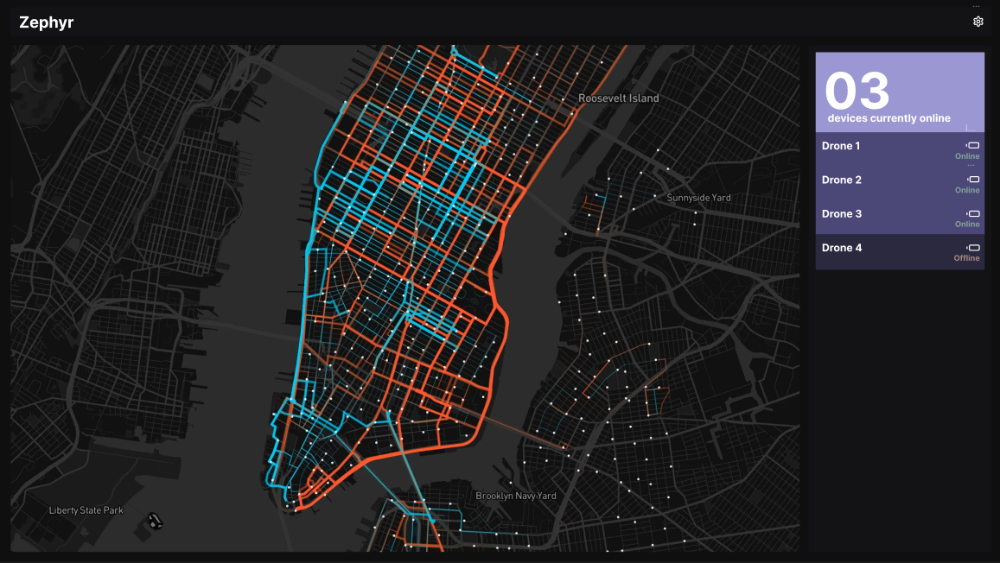
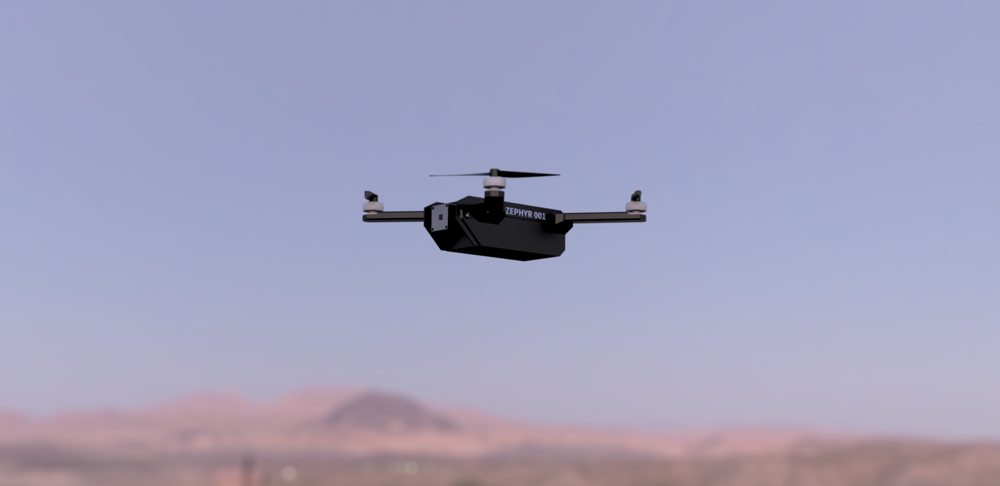

# July 14th: Initial research & modelling
By: Radean

Began to research the various components of a drone, identifying how we'd wire everything and get them to work. I began by laying out our software requirements, then searched for parts that would be able to fulfill them. The initial plan was to use an arduino to control the drone and a Raspberry Pi for the compute that we'd need, but after looking at various FPV drone guides and online tutorials, I came to realize that using a dedicated flight controller & ESC stack would be much more effective and still be capable of communicating with the Raspberry Pi. Based on the size of the drone and some rough weight calculations (Raspi is about 50g, flight controller stack is about 25g, assume 50g per motor) I also determined that we'd likely need 7inch props, informing the choice of motors and battery. Here is a rough diagram I made outlining the general flow of components in the system:



I also looked at some drone designs online and began modelling a basic chassis that would be capable of housing the various parts. I had to CAD my own version of the flight controller stack, as no online models were available, but I ended up being able to package everything in a way that leaves no space unused and should be fairly easy to access:
 

**Total time spent: 4h**

# July 16th: Continued CAD
By: Alex

By working off of Radean's basic chassis, I was able to model a more refined version, giving more consideration to the battery placement, since it is one of the largest electrical components of our drone. As there were no available CAD models online, I blocked out a dummy. I then gave the chassis openings on the top and the rear so that we would have easy access to the internal components of the chassis during construction and regular usage.

 

After determining that we wanted to mount the motors and propellors in an X-shape, and after deciding on using 5-inch propellers, I made some simple measurements and placed out our four motors in a new CAD file for later reference:


**Total time spent: 2h**

# July 21st: Camera Housing
By: Radean

Identifying a need to create a housing for the Raspberry Pi camera module, both to securely mount it and to shield it, I worked on creating a suitable case. I began by finding a drawing of the camera online, off of which I created a rough sketch for the base of the housing. After some time struggling to find a model for the camera module online, I succeeded in downloading one and added it to fusion, adding it to the sketch and making extrusions to fit it. Finally, I added a small hole for a screw joint on the back of the case so that it can be attached to the rest of the drone.


**Total time spent: 2h**

# July 23rd: Propeller Arms
By: Alex

I first created four extrusions on the main chassis where the propeller arms could be attached.


I then took my previous blockout of the motor positioning and built up four arms in CAD that would attach to the extrusions on the main chassis. The design for these arms took a couple iterations. It would also be beneficial to create supportive trusses underneath the arms to decrease the risk of the arms snapping off, as PLA is relatively weak.



**Total time spent: 3h**

# July 24th: Arm Improvements & Assembly
By: Radean

Building upon Alex's work, I began by adding a "roof" to each of the arms, helping to shield the wires and electronics that will run through them and providing increased structural support. These were constructed to almost perfectly fit the motors (aside from some tolerance) to ensure optimal coverage of the area across which the wires will be run.


I then started work on adding the camera to the rest of the chassis assembly. I thought that it may be suboptimal to just screw it in for fear of it getting loose, and spent some time looking at ways different companies mounted their cameras, but couldn't find any particularly good alternatives, especially compared to the ease of using a screw. I looked into different ways of adding screws to the CAD, learning how to use Fusion's own "Fastener" tool/library and trying to insert something that way, but I wasn't able to find anything that was the proper length (70cm) despite spending significant time trying. As a result, I ended up finding a suitable screw on the McMaster-Carr website and importing that. Finally, I added some reinforcements to the outside walls of the drone so that the screws wouldn't shatter them.




**Total time spent: 4h**

# July 25th: Roof redesign + minor tweaks
By: Radean

I fully assembled our current work, adding the arms (which had their own file on an outdated version of the chassis) to the latest version of the chassis, which also includes the camera. I also worked on redesigning the roof, which I felt looked weird and would have been very difficult to attach to the rest of the body. Due to some weird version history, this forced me to start almost from scratch on much of the chassis, as simply deleting the chamfers destroyed the entire CAD. Rather than making it angled, I made the roof flat so that it will be easier to assemble, then added some slight fillets and chamfers for style. I also changed the colour in the CAD to black - the colour of the filament I have available.



**Total time spent: 3h**

# July 25th: Arm redesign
By: Alex

I had noticed that the propellor arms were unnecessarily large and blocky. This meant that they would be heavy and an inefficient usage of filament. Firstly, I undid some of the initial chamfering so the arm roofs could fit better. I then shortened, widened, and chamfered the roofs to give them a lower overall profile. I made sure to maintain enough space within the roofs to hold wires.


I then made some stylish adjustments to the chassis.

**Total time spent: 2h**

# July 28th: Software
By: Radean

I began working on the software for the drone. Although the vehicle itself is needed to implement a lot of the things we want (as we need to tune in accordance with motor strength, power levels, computing power, etc.), there are still a number of features that can be worked on in advance, like the connection to the flight controller, the AI model for detecting objects and the design of the website we will use to control it.

First off, I created a rough outline of what the dashboard will look like in Figma, making sure to include key utilities such as the map, list of connections and the status of various drones. I used realtime colours to create a custom scheme that will ensure consistent styling across the site:

 

I then spent a lot of time researching the different ways to connect the Raspberry Pi to the flight controller. I didn't really know where to start, and my mind at first went to somehow connecting them via USB, but I realized after a number of hours that it would be possible to directly connect the two via UART. Since our plan was to use ArduPilot for the flight controller, I spent some time reading through the documentation for that and saw that it would be best to use the MAVLink protocol to get full access to ArduPilot's features, leading me to write up the code for a basic connection from the Raspberry Pi:

```python
from pymavlink import mavutil

# Connection to flight controller
zephyr = mavutil.mavlink_connection('/devserial0', baud=115200)
```

Finally, I started work on a custom YOLO model for object detection. I spent some time finding a premade dataset with aerial shots, adding on to the dataset with some of my own images, learning how to train the model and debugging issues with training on CUDA. This culminated in the first draft of the model, which, although somewhat inaccurate, is a good starting point off of which I can improve:


**Total time spent: 7h**

# July 29th: Props
By: Radean

Looking at the prices of propellers online, I realized that it would be more economical and easier to print our own. Because no companies had their own CAD models, I spent some time trying out different designs, but I couldn't quite get the curvature of the blades correct, and eventually found an online tutorial that helped me customize my own. I tried simply mirroring this initial CCW propeller to get a CW propeller, but for some reason, fusion made the edges of the blades jagged. After putting some time into trying to fix this, I gave up and cadded a distinct CW propeller. I then added these all to the main chassis CAD and styled it further by adding text for the name of the vehicle, finishing off the important pieces we need for the project and leaving finishing touches.


I then spent some time experimenting with the fusion render workspace. After a number of different combinations and attempts, I created the following, which we plan on using as the banner for our README:



**Total time spent: 3h**