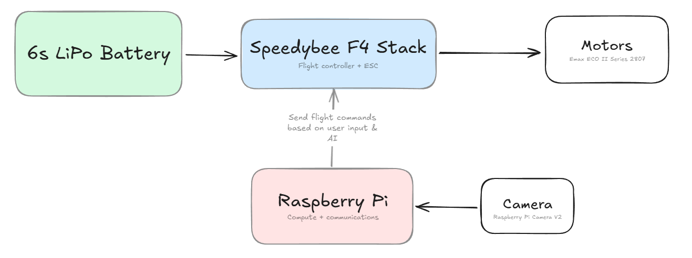

# July 14th: Initial research & modelling
By: Radean

Began to research the various components of a drone, identifying how we'd wire everything and get them to work. I began by laying out our software requirements, then searched for parts that would be able to fulfill them. The initial plan was to use an arduino to control the drone and a Raspberry Pi for the compute that we'd need, but after looking at various FPV drone guides and online tutorials, I came to realize that using a dedicated flight controller & ESC stack would be much more effective and still be capable of communicating with the Raspberry Pi. Based on the size of the drone and some rough weight calculations (Raspi is about 50g, flight controller stack is about 25g, assume 50g per motor) I also determined that we'd likely need 7inch props, informing the choice of motors and battery. Here is a rough diagram I made outlining the general flow of components in the system:

I also looked at some drone designs online and began modelling a basic chassis that would be capable of housing the various parts. I had to CAD my own version of the flight controller stack, as no online models were available, but I ended up being able to package everything in a way that leaves no space unused and should be fairly easy to access:
 

**Total time spent: 4h**

# July 16th: Continued CAD
By: Alex

By working off of Radean's basic chassis, I was able to model a more refined version, giving more consideration to the battery placement, since it is one of the largest electrical components of our drone. As there were no available CAD models online, I blocked out a dummy. I then gave the chassis openings on the top and the rear so that we would have easy access to the internal components of the chassis during construction and regular usage.

 

After determining that we wanted to mount the motors and propellors in an X-shape, and after deciding on using 5-inch propellers, I made some simple measurements and placed out our four motors in a new CAD file for later reference:

**Total time spent: 2h**

# July 21st: Camera Housing
By: Radean

Identifying a need to create a housing for the Raspberry Pi camera module, both to securely mount it and to shield it, I worked on creating a suitable case. I began by finding a drawing of the camera online, off of which I created a rough sketch for the base of the housing. After some time struggling to find a model for the camera module online, I succeeded in downloading one and added it to fusion, adding it to the sketch and making extrusions to fit it. Finally, I added a small hole for a screw joint on the back of the case so that it can be attached to the rest of the drone.

**Total time spent: 2h**