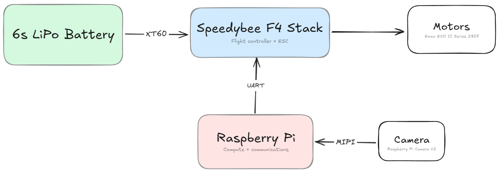

# Zephyr

Zephyr is an AI powered autonomous drone built for intelligence, surveillance and reconnaissance. It uses an onboard camera and Raspberry Pi 5 to process its surroundings with machine learning, identifying objects of interest, marking them to create detailed maps of various locations and pursuing them (will only be used on the creators for fun, no intention to test on actual people!).

We've always been interested in military technology, whether it be planes, tanks or ships. After seeing Anduril's Bolt/Bolt-M, we were inspired by their slick design and features and want a chance to test our own design skills in making something that is not only equal, but smaller, lighter and cheaper. We would also love to learn more about design for aerial vehicles and test a drone, something which has as of yet been out of our reach due to the relatively high cost.

It will be wired as follows:

BOM (note that we will be providing the Raspberry Pi and cover the excess cost for other parts ourselves):

| Name                                                                 | Cost (per) | Quantity | Total (USD) | Link (prices may be in CAD)                                                                                                                                        |
| -------------------------------------------------------------------- | ---------- | -------- | ----------- | ------------------------------------------------------------------------------------------------------------------------------------------------------------------------------------------------------------------------------------------------------------------------------------------------------------------------------------------------------------------------------------------------------------------------------------------------------------------------------------------------------------------------------------------------------------------------------------------------------------ |
| XING2 2207 1855KV (4pcs)                                             | $72.04     | 1        | $72.04      | https://www.amazon.ca/Brushless-IFlight-Titanium-5-1inch-Propeller/dp/B0DG8QN6KY/ref=sr_1_1?camp=1789&creative=9325&dib=eyJ2IjoiMSJ9.wG12yD-47zzE7JugM8AdLFLw7hBbt9_FuFuLp_bSGvP7XL1boAS8LG2uX7Pt_xG27tKxtBWW8-uQckpGlw7gfPSZodZzWiLCtNH1kZYf_qplYvv50dtzXwDJ6UMa-S_bIKS3DhkqJRH1630F7JWeArwmkJJ6zoKaMB5pSMnHLJ271mbREbWS3NU8dQXQmjU6WCqSE7eWh-ZGGdv51gRYTgKbaoBJLfZmGHlCObdgGXNOf4BizCh6jjhV6LwsANvLTX2HHEQ7flzwwzrinAO4nH1wta9Eu5Zg83RUcglSBaA.lSENu25EARUPof9ZKgl-s_l6Q8YyHODaAQLqf_wlFXs&dib_tag=se&keywords=iflight+xing2+2207+motor&linkId=b0f4e1722984de7d3ad2218a36c6f5d5&qid=1752642036&sr=8-1&th=1 |
| Raspberry Pi 5 (4gb)                                                 | $62.40     | 1        | $62.40      | https://www.pishop.ca/product/raspberry-pi-5-4gb/                                                                                                                                                                                                                                                                                                                                                                                                                                                                                                                                                            |
| OVONIC 1300mAh 100C 6S 22.2V Lipo Battery XT60 Plug For FPV Racing Drone Quadcopter                               | $15.00     | 1        | $15.00      | https://www.aliexpress.com/item/1005009531320120.html?algo_pvid=78af2d76-1ba8-4fdb-97d0-2c71bdb8c016&algo_exp_id=78af2d76-1ba8-4fdb-97d0-2c71bdb8c016-17&pdp_ext_f=%7B%22order%22:%2210%22,%22eval%22:%221%22%7D&pdp_npi=6@dis!CAD!55.47!21.40!!!283.00!109.15!@210308a417545155783404164e3bf6!12000049381035311!sea!CA!0!ABX!1!0!&curPageLogUid=bRyX2jVUhfbc&utparam-url=scene:search%7Cquery_from:                                                                                                                                                                                                                                                                                                                                                                                                                                                                                                                                              |
| SpeedyBee F4 V4 Stack - F405 V4 FC + 60A BLHeli_S 4-in-1 ESC - 30x30 | $69.18     | 1        | $69.18      | https://www.aliexpress.com/item/1005009474933895.html?spm=a2g0o.productlist.main.1.30853680yL6zf9&aem_p4p_detail=202508062027062250926890009980000041608&algo_pvid=233eeedf-313f-4779-9d01-f8ca1097715d&algo_exp_id=233eeedf-313f-4779-9d01-f8ca1097715d-0&pdp_ext_f=%7B%22order%22%3A%2225%22%2C%22eval%22%3A%221%22%7D&pdp_npi=6%40dis%21CAD%21274.26%2195.99%21%21%211401.43%21490.49%21%402103209b17545372267618375e19cc%2112000049215356589%21sea%21CA%210%21ABX%211%210%21&curPageLogUid=JqgepStjY2os&utparam-url=scene%3Asearch%7Cquery_from%3A&search_p4p_id=202508062027062250926890009980000041608_1                                                                                                                                                                                                                                                                                                                                                                                                                                                                                                                   |
| Raspberry Pi Camera V2 - 8MP                                         | $16.13     | 1        | $16.13      | https://www.pishop.ca/product/raspberry-pi-8mp-camera-board-v2/                                                                                                                                                                                                                                                                                                                                                                                                                                                                                                                                              |
| Total (incl. tax) | $264.14
